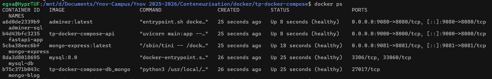
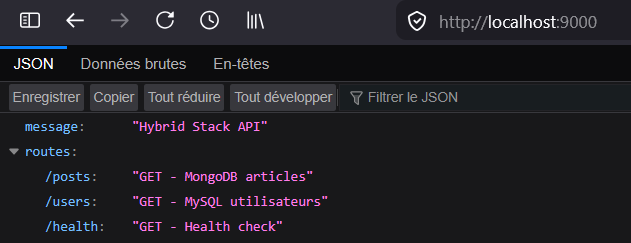
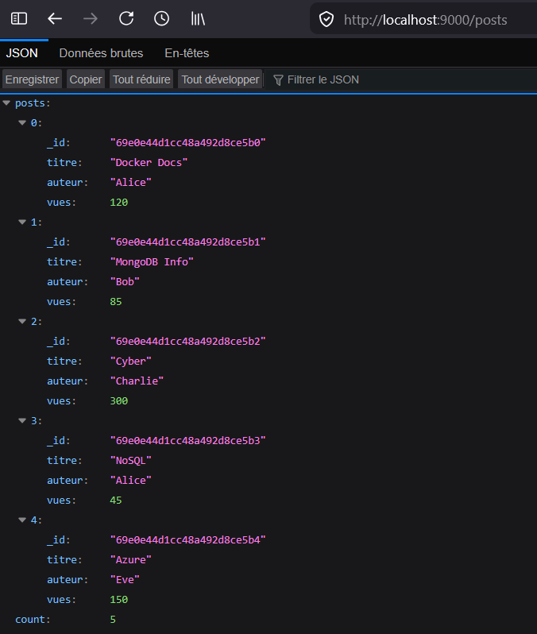
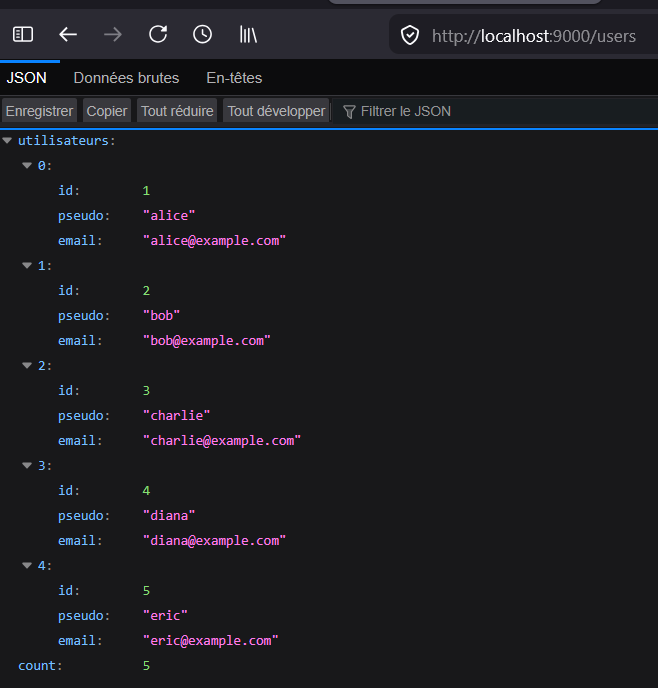
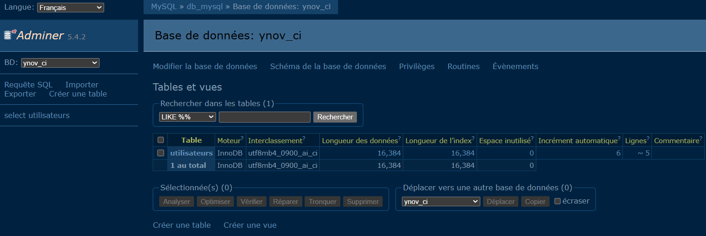
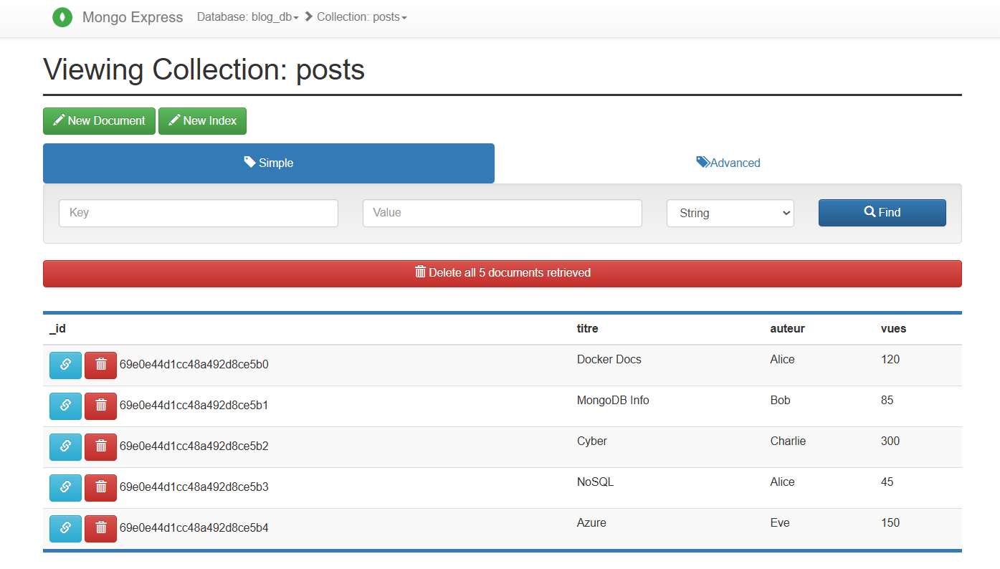

# Orchestration d'une Stack Hybride avec Docker Compose

---

## Objectifs

Déployer une architecture multi-services pilotant **simultanément** une base de données SQL (MySQL) et NoSQL (MongoDB) de manière orchestrée et résiliente.

---

## Architecture

Cette stack orchestre **5 services** via un unique `docker-compose.yml` :

| Service | Type | Image | Rôle |
|---------|------|-------|------|
| **db_mongo** | Database | MongoDB personnalisée (non-root) | Base NoSQL pour les articles |
| **db_mysql** | Database | MySQL 9.6 | Base SQL pour les utilisateurs |
| **admin_mongo** | Interface | Mongo Express | Gestion visuelle MongoDB |
| **admin_mysql** | Interface | Adminer | Gestion visuelle MySQL |
| **api** | Application | FastAPI (Python) | Pont hybride MongoDB ↔ MySQL |

---

## Contraintes Techniques Respectées

### 2.1 Orchestration & Résilience

- **Politique de restart** : `on-failure` — redémarrage automatique seulement en cas d'erreur (crash)
- **Dépendances & Ordre de démarrage** :
  - `api` démarre **uniquement** si `db_mongo` ET `db_mysql` sont healthy
  - `admin_mongo` démarre uniquement si `db_mongo` est healthy
  - `admin_mysql` démarre uniquement si `db_mysql` est healthy

### 2.2 Healthchecks "Métiers" Stricts

#### MongoDB (`db_mongo`)
```bash
mongosh -u "$MONGODB_INITDB_ROOT_USERNAME" \
  -p "$MONGODB_INITDB_ROOT_PASSWORD" \
  --authenticationDatabase admin \
  --quiet --eval "db.getSiblingDB('blog_db').posts.countDocuments()" | \
  grep -q -E '^5$' && echo 'SUCCÈS: 5 posts trouvés' || exit 1
```
Valide que la collection `posts` contient **exactement 5 documents**

#### MySQL (`db_mysql`)
```bash
mysql -u${MYSQL_USER} -p${MYSQL_PASSWORD} \
  -h localhost -D ${MYSQL_DATABASE} \
  -e "SELECT COUNT(*) FROM utilisateurs" | \
  grep -E '^[0-9]' && echo 'SUCCÈS: Table utilisateurs vérifiée' || exit 1
```
Valide que la table `utilisateurs` est accessible et contient des données

#### API (`api`)
```bash
curl -f http://localhost:8000/health
```
Valide que l'API communique avec les **deux bases** via `/health`

### 2.3 Développement & Dockerisation

- **Dockerfile API** : Python 3.12-slim avec FastAPI, uvicorn, mysql-connector, pymongo
- **Dockerfile MongoDB** : Image personnalisée non-root, validation de schéma
- **`.dockerignore`** : Exclut `.git`, `__pycache__`, `.venv`, `.env`
- **`.gitignore`** : Exclut `.venv`, `__pycache__`, `.env`, volumes Docker

### 2.4 Routes Hybrides FastAPI

#### Route 1 : `GET /posts`
Retourne les articles depuis **MongoDB** :
```json
{
  "posts": [
    {"_id": "507f1f77bcf86cd799439011", "titre": "...", "auteur": "...", "vues": ...},
    ...
  ],
  "count": 5
}
```

#### Route 2 : `GET /users`
Retourne les utilisateurs depuis **MySQL** :
```json
{
  "utilisateurs": [
    {"id": 1, "pseudo": "alice", "email": "alice@example.com"},
    ...
  ],
  "count": 5
}
```

### 3. Sécurité & Volumes

- **Volumes nommés** : `mongo_data` et `mysql_data` assurent la persistance
- **Pas de mot de passe en dur** : Tous les secrets viennent du `.env`
- **Isolation réseau** : 
  - Bases (MongoDB, MySQL) **non publiées** sur l'hôte → uniquement réseau interne
  - Seules interfaces web + API sont exposées (`9081`, `9080`, `9000`)

---

## Structure du Projet

```
tp-docker-compose/
├── docker-compose.yml          # Orchestration des 5 services
├── .env                         # Variables d'environnement (local)
├── .env.example                 # Template .env pour la documentation
├── .gitignore                   # Exclusions Git
├── README.md                    # Ce fichier
│
├── api/
│   ├── Dockerfile               # Image FastAPI
│   ├── main.py                  # Routes hybrides : /posts, /users, /health
│   └── .dockerignore            # Exclusions build Docker
│
├── mongo/
│   ├── Dockerfile               # Image MongoDB non-root personnalisée
│   ├── db.js                    # Script d'initialisation MongoDB
│   ├── check-status.sh          # Test de connectivité (optionnel)
│   └── .dockerignore            # Exclusions build Docker
│
├── sqlfiles/
│   ├── migration-v001.sql       # CREATE DATABASE ynov_ci
│   ├── migration-v002.sql       # CREATE TABLE utilisateurs
│   └── migration-v003.sql       # INSERT 5 utilisateurs
│
└── images/                      # Captures d'écran du livrable
    ├── docker-compose-ps.png    # État des services (healthy)
    ├── api-routes.png           # Routes /posts et /users en JSON
    └── (autres captures)
```

---

## Installation et Déploiement

### Prérequis
- Docker Engine >= 20.10
- Docker Compose >= 1.29

### Étapes

1. **Cloner/accéder au projet**
   ```bash
   cd tp-docker-compose
   ```

2. **Configurer les variables d'environnement**
   ```bash
   cp .env.example .env
   # Éditer .env avec vos valeurs
   ```

3. **Lancer la stack**
   ```bash
   docker compose up -d --build
   ```
   - `--build` : Reconstruit les images personnalisées (api, mongo)
   - `-d` : Mode détaché (arrière-plan)

4. **Vérifier les services**
   ```bash
   docker compose ps
   ```
   Vous devriez voir tous les services avec le statut `(healthy)`.

### Arrêter la stack
```bash
docker compose down
```

### Nettoyer les volumes (supprimer les données)
```bash
docker compose down -v
```

---

## Tests des Routes Hybrides

### Vérifier l'état global
```bash
curl http://localhost:9000/health
```

### Route 1 : Récupérer les articles MongoDB
```bash
curl http://localhost:9000/posts
```

### Route 2 : Récupérer les utilisateurs MySQL
```bash
curl http://localhost:9000/users
```

### Accès aux interfaces web
- **MongoDB Express** : http://localhost:9081
  - Username : `admin`
  - Password : (voir `.env`)
  
- **Adminer** : http://localhost:9080
  - Serveur : `db_mysql`
  - Utilisateur : `ynov_user`
  - Mot de passe : (voir `.env`)
  - Base : `ynov_ci`

---

## Captures d'écran - Livrable

### 1. État des services (docker compose ps)

*Tous les 5 services en statut (healthy)*

### 2. Page d'accueil API avec les routes disponibles

*Routes disponibles : `/posts`, `/users`, `/health`*

### 3. Route hybride `/posts` - MongoDB


*Affiche 5 articles depuis la collection MongoDB `blog_db.posts` avec count = 5*

### 4. Route hybride `/users` - MySQL


*Affiche 5 utilisateurs depuis la table MySQL `ynov_ci.utilisateurs` avec count = 5*

### 5. Interface Adminer


*Affiche l'interface de Adminer pour vérifer que cela fonctionne*

### 6. Affichage des posts (`blog_db`)


*Affiche la liste de tout les posts existants sur mongodb*